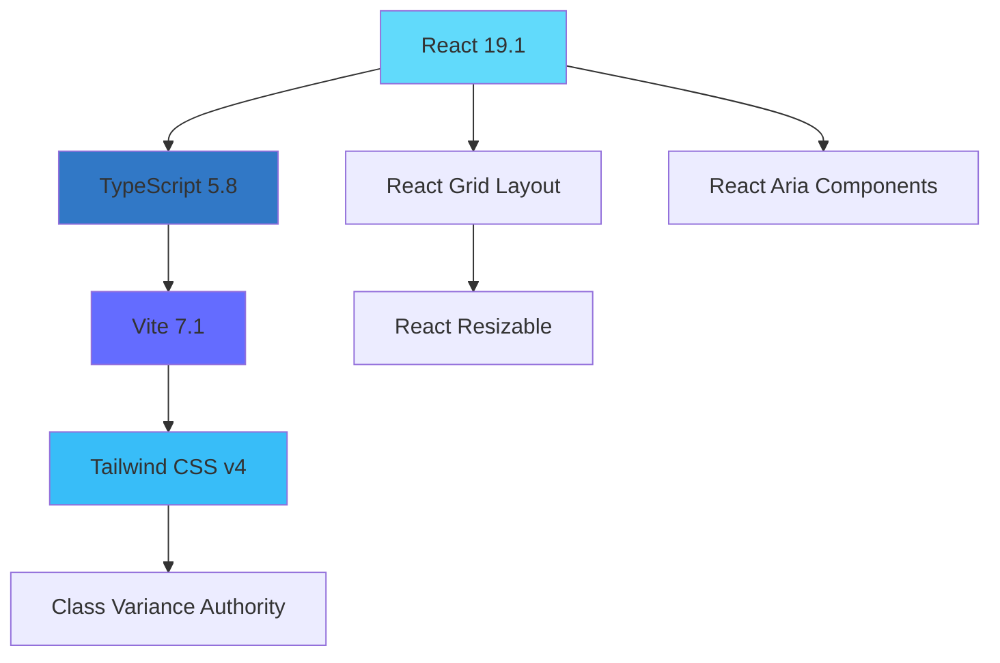

# React Grid Layout Demo - 项目文档库

本文档库包含项目中使用的所有核心依赖库的详细文档，方便开发和维护时查阅。

## 📋 文档概览

### 核心库文档

| 库名                                                              | 版本    | 描述                    | 状态      |
| ----------------------------------------------------------------- | ------- | ----------------------- | --------- |
| [React Grid Layout](./core-libraries/react-grid-layout/README.md) | v1.5.2  | 响应式网格布局系统      | ✅ 完整   |
| [React Resizable](./core-libraries/react-resizable/README.md)     | v3.0.5  | 可调整大小组件          | 🔄 待补充 |
| [Tailwind CSS](./core-libraries/tailwindcss/README.md)            | v4.1.11 | 实用优先的 CSS 框架     | 🔄 待补充 |
| [Vite](./core-libraries/vite/README.md)                           | v7.1.2  | 下一代前端构建工具      | ✅ 完整   |
| [TypeScript](./core-libraries/typescript/README.md)               | v5.8.3  | JavaScript 超集类型系统 | ✅ 完整   |

### UI 组件库文档

| 库名                                                                     | 版本    | 描述                | 状态      |
| ------------------------------------------------------------------------ | ------- | ------------------- | --------- |
| [React Aria Components](./ui-components/react-aria-components/README.md) | v1.11.0 | 无障碍 React 组件库 | ✅ 完整   |
| [Untitled UI React](./ui-components/untitled-ui-react/README.md)         | v0.0.19 | 开源 React UI 组件  | 🔄 待补充 |

### 工具库文档

| 库名                                                                       | 版本   | 描述             | 状态      |
| -------------------------------------------------------------------------- | ------ | ---------------- | --------- |
| [Class Variance Authority](./utilities/class-variance-authority/README.md) | v0.7.1 | 组件样式变体管理 | 🔄 待补充 |

## 🚀 快速导航

### 按功能分类

#### 🏗️ 布局和网格

- **主要**: [React Grid Layout](./core-libraries/react-grid-layout/README.md) - 响应式拖拽网格系统
- **辅助**: [React Resizable](./core-libraries/react-resizable/README.md) - 独立可调整大小功能

#### 🎨 样式和主题

- **框架**: [Tailwind CSS](./core-libraries/tailwindcss/README.md) - CSS-first 实用工具框架
- **变体**: [Class Variance Authority](./utilities/class-variance-authority/README.md) - 样式变体管理

#### 🧩 组件和 UI

- **可访问性**: [React Aria Components](./ui-components/react-aria-components/README.md) - WAI-ARIA 标准组件
- **设计系统**: [Untitled UI React](./ui-components/untitled-ui-react/README.md) - 现代 UI 组件集

#### 🔧 开发工具

- **构建**: [Vite](./core-libraries/vite/README.md) - 极速开发服务器和构建工具
- **类型**: [TypeScript](./core-libraries/typescript/README.md) - 静态类型检查

## 📚 集成指南

### [网格布局与样式集成](./integration-guides/grid-layout-with-tailwind.md)

如何将 React Grid Layout 与 Tailwind CSS 完美结合，实现响应式设计。

### [可访问性最佳实践](./integration-guides/accessibility-patterns.md)

使用 React Aria Components 构建无障碍用户界面的最佳实践。

### [可调整大小组件指南](./integration-guides/resizable-components-guide.md)

React Resizable 的独立使用和与网格系统的集成方式。

## 🎯 项目特色技术栈

### 现代化前端技术



### 核心优势

- ⚡ **极速开发**: Vite HMR + TypeScript
- ♿ **完全可访问**: React Aria 标准
- 🎨 **灵活样式**: Tailwind CSS v4 CSS-first
- 📱 **响应式网格**: 拖拽调整 + 断点适配
- 🔧 **类型安全**: 全面 TypeScript 支持

## 📖 使用指南

### 查看特定库文档

```bash
# 查看核心库
doc/core-libraries/[library-name]/README.md

# 查看 UI 组件
doc/ui-components/[component-name]/README.md

# 查看工具库
doc/utilities/[utility-name]/README.md
```

### 文档结构

每个库的文档都包含以下部分：

- `README.md` - 概述和快速入门
- `api-reference.md` - 详细 API 文档
- `best-practices.md` - 最佳实践指南
- `examples.md` - 代码示例集合

## 🔄 更新记录

| 日期       | 更新内容                   | 状态 |
| ---------- | -------------------------- | ---- |
| 2025-01-19 | 初始文档库创建             | ✅   |
| 2025-01-19 | React Grid Layout 完整文档 | ✅   |
| 2025-01-19 | Vite 核心文档              | ✅   |
| 2025-01-19 | TypeScript 完整文档        | ✅   |
| 2025-01-19 | React Aria Components 文档 | ✅   |

## 📞 文档反馈

如果你在使用过程中发现文档问题或需要补充内容，请：

1. 检查对应库的官方文档获取最新信息
2. 在项目 Issues 中提出文档改进建议
3. 参考 `CLAUDE.md` 中的项目开发指南

---

**💡 提示**: 本文档库基于项目 `package.json` 中的依赖版本创建，建议定期更新以保持同步。
